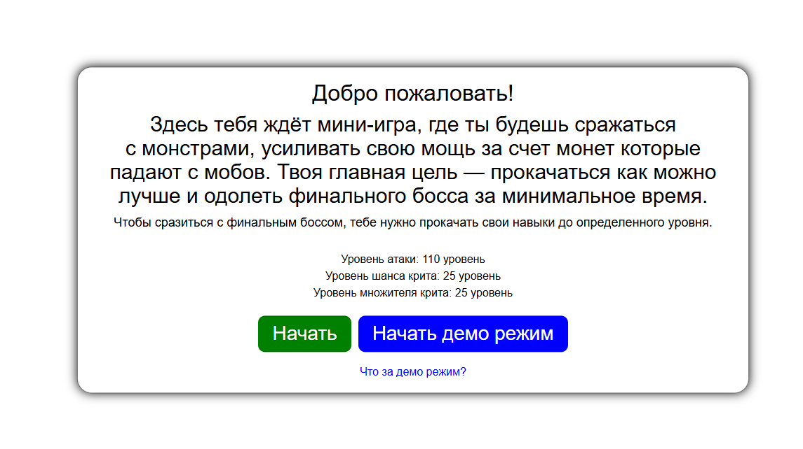

# Tap-Tap-MonsterHunter

## Эта небольшая мини игра, популярная на мобильных телефонах, вдохновлялся игрой (Tap Titans 2).



## Стек технологий:
<div>
  
  
  
  
  
  
  
  
  
  
</div>

## Цель проекта:
- Практика работы с React, TypeScript и архитектурой приложения (контексты, состояние, игровая логика), а также создание небольшого игрового проекта для портфолио, основная часть идет на обучение контекста.

## Как запустить проект?
```bash

# Скопировать проект
git clone https://github.com/HELLRAID-cmd/Tap-Tap-MonsterHunter.git

# Перейти в папку client
cd client

# Установить зависимости
npm i

# Запустить проект
npm run dev
```

## Адаптивность:
Проект оптимизирован под мобильные устройства.
Минимальная комфортная ширина просмотра — 330px.

## Связаться со мной:
<a href="https://t.me/HELLRAD1" target="_blank">
  
</a>
<a href="mailto:emilgainulinjob@gmail.com" target="_blank">
  
</a>
